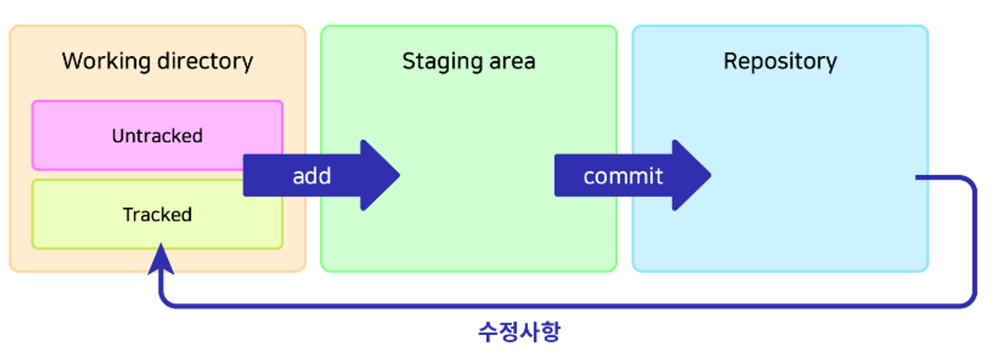

# Git 사용법 (1)

### Git의 3가지 공간



### **Working directory**

- untracked
  - Add된 적 없는 파일, ignore 된 파일
- tracked
  - Add된 적 있고 변경내역이 있는 파일
- `git add` 명령어로 Staging area로 이동

### **Staging area**

- 커밋을 위한 준비 단계임
  - 예시: 작업을 위해 선택된 파일들
- `git commit` 명령어로 repository로 이동함

### **Repository**

- `.git directory`라고도 불림
- 커밋된 상태
  - 즉, 커밋들이 저장된 곳

위 그림에서 어떠한 파일을 **그릇**으로 비유해보겠습니다.

| 상태                 | 설명                                                                      |
| -------------------- | ------------------------------------------------------------------------- |
| untracked            | 식기세척기에 들어가 본 적이 없거나 식기세척기 사용이 불가(ignored)한 그릇 |
| tracked              | 식기세척기에 들어가 본 적이 있고 식기세척기 사용이 가능한 그릇            |
| add                  | 식기세척기에 넣는 행위                                                    |
| staging area         | 식기세척기 안(에 들어간 상태)                                             |
| commit               | 세척(식기세척기 가동)                                                     |
| repository           | 세척되어 깨끗해진 상태                                                    |
| 파일에 수정이 가해짐 | 그릇이 사용되어 이물질(커밋되지 않은 변경사항)이 묻음                     |
| working directory    | 세척되어야 하는 상태                                                      |

- **tracked**가 된다는 건, Git의 관리대상에 정식으로 등록됨을 의미함.
- 새로 추가되는 파일은 반드시 **add**해줌으로써, 해당 파일이 tracked될 것임을 명시해야 하는 이유입니다.
- _(Git이 새 파일들을 무조건 다 관리해버리는 것을 방지)_

<br/>

## **파일의 삭제와 이동**

```yaml
# 파일 직접 상태하면 working directory에 있음
# 파일을 git rm '파일명' 으로 삭제하면 Staging area에 있음

git rm '파일명'
# git rm '파일명'한  git reset --hard로 파일 복원 가능함

# 파일의 이름을 변경하면 Staging area에 있음
# git mv '파일명'
git mv '파일명'
```

<br/>

## 커밋하지 않은 변경사항 되돌리기

### **파일을 staging area에서 working directory로 되돌리기**

```yaml
# 특정 파일을 지정된 상태로 복구
# add가 안된상태에서 --staged를 빼면 working directory에서도 제거됨
git restore (파일명)
	# - 워킹 디렉토리의 특정 파일 복구
	# - 파일명 자리에 . : 모든 파일 복구

# 변경상태인 파일을 **staging area**에서 **working directory**로 돌려놓기
git restore --staged (파일명)

# 파일을 특정 커밋의 상태로 되돌리기
git restore --source=(헤드 또는 커밋 해시) 파일명
```

<br/>

## **reset의 세 가지 옵션**

- soft: `repository`에서 `staging area`로 이동함
- mixed (default): `repository`에서 `working directory`로 이동함
- hard: 수정사항 완전히 삭제함, Working directory에서 삭제됨

  ```yaml

  # repository에서 staging area로 이동함
  git reset --soft '커밋번호'

  # repository에서 working directory로 이동함
  git reset --mixed '커밋번호'

  # 수정사항 완전히 삭제함, Working directory에서 삭제됨
  git reset --hard '커밋번호'
  ```

<br/>

## reset한 커밋 복구

```yaml
#  reset으로 커밋 15개 되돌림
git reset --hard HAED~15

# reset으로 사라진 커밋을 복구할 수 있는 reflog 명령어
git reflog
	# - reflog는 프로젝트가 위치한 커밋이 바뀔 때마다 기록되는 내역을 보여주고
	# - 이를 사용하여 reset하기 이전 시점으로 프로젝트를 복구할 수 있다.
```

<br/>

# **Git의 HEAD**

```yaml
# switch로 브랜치를 이동함
git switch '브랜치명'

# branch 간 이동하기
git checkout [branch name]

# branch 이름 바꾸기
git branch -M [changed name]

# branch 생성하기
git checkout -b [branch name]

# HEAD를 앞뒤 이동할 수 있음
# ^ 또는 ~: 갯수만큼 이전으로 이동함
# git checkout HEAD^^^, git checkout HEAD~5
git checkout HEAD^

# 커밋 해시를 사용해서도 이동 가능함
git checkout (커밋해시)

# (이동을) 한 단계 되돌리기, ctrl + z와 유사함
git checkout -

# HEAD 사용하여 reset하기
git reset --hard HEAD(원하는 단계) (옵션)

# 두 단계의 브랜치가 사라짐
# git reset --hard HEAD~2
# git reset --hard HEAD^2
```

<br/>

## **fetch와 pull의 차이**

- `fetch`: 원격 저장소의 최신 커밋을 로컬로 가져오기만 함
- `pull`: 원격 저장소의 최신 커밋을 로컬로 가져와 `merge` 또는 `rebase` 함

<br/>

### fetch 한 내역 적용 전 살펴보기

```yaml
# fetch 한 내역 적용 전 살펴보기

# 1.원격의 main 브랜치에 커밋 추가
# git checkout origin/main으로 확인해보기

# 2. 원격의 변경사항 fetch
# git checkout origin/main으로 확인해보기
# pull로 적용

# **원격의 새 브랜치 확인
#** git checkout origin/(main)

git checkout origin/(브랜치명)
git switch -t origin/(브랜치명)
```

<br/>

## **git help**

```yaml
# Git 사용 중 모르는 부분이 있을 때 도움을 받을 수 있는 기능
# 기본적인 명령어들과 설명
git help

# git의 모든 명령어
# j로 내리기, k로 올리기, :q로 닫기
git help -a

# 해당 명령어의 설명과 옵션 보기
git (명령어) -h

# 해당 명령어의 설명과 옵션 웹사이트에서 보기
# 웹에서 열리지 않을 시 끝에 -w를 붙여 명시하기
git help (명령어)
git (명령어) --help
```

<br/>

## global 설정과 local 설정

```yaml
# config를 --global과 함께 지정하면 전역으로 설정됩니다.
# 설정한 이름이 반환됨
git config --global user.name

# 특정 프로젝트에 이름, 이메일 설정함
git config user.name '변경 이름'
git config user.name '변경 이메일주소'
```

<br/>

### 설정값 확인

```yaml
# 설정값 확인

# 현재 모든 설정값 보기
git config (global) --list

# 에디터에서 보기 (기본: vi)
git config (global) -e
```

<br/>

### 기본 에디터 수정

```yaml
# 기본 에디터 수정

git config --global core.editor "code --wait"
# 또는 code 자리에 원하는 편집 프로그램의 .exe파일 경로 연결
# --wait : 에디터에서 수정하는 동안 CLI를 정지
# git commit 등의 편집도 지정된 에디터에서 열게 됨
```

<br/>

### 유용한 설정들

```yaml
# 줄바꿈 호환 문제 해결
# git config --global core.autocrlf (윈도우: true / 맥: input)
git config --global core.autocrlf true

# pull 기본 전략 merge 또는 rebase로 설정
git config pull.rebase false
git config pull.rebase true

# 기본 브랜치명
git config --global init.defaultBranch main

# push시 로컬과 동일한 브랜치명으로
git config --global push.default current
```

<br/>

### **단축키 설정**

```yaml
git config --global alias.(단축키) "명령어"
# 예시: git config --global alias.cam "commit -am"
```

---

# 참고

- 얄코, github 강의
- [https://github.com/JaeYeopHan/Minimal_Git_command?tab=readme-ov-file#remote-repository-등록하기](https://github.com/JaeYeopHan/Minimal_Git_command?tab=readme-ov-file#remote-repository-%EB%93%B1%EB%A1%9D%ED%95%98%EA%B8%B0)
